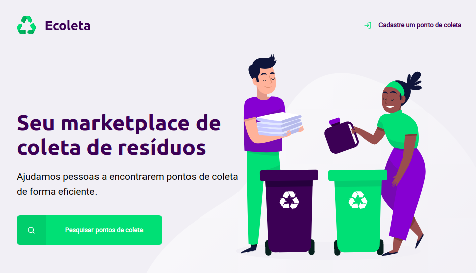
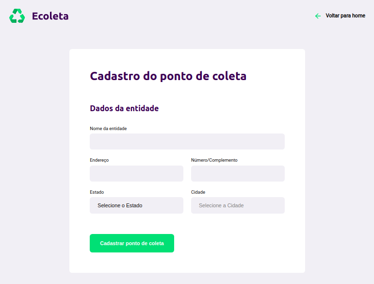

<h1 align='center'> Next Level Week by  </h1>

&emsp;Projeto Web realizado durante a Next Level Week, bootcamp realizado pela Rocketseat. A plataforma consiste em um ambiente para registrar pentidades que realizam coleta de materiais reciclaveis. 

<h3>
🥳 Dia 1 - Construção da Home: 
</h3>

&emsp;Foi feita a Home do projeto utilizando apenas HTML e CSS. Utilizando os materiais (arquivos svg) disponibilizados pela Rocketseat pode ser feito a Home interativa e responsiva. 

<h3>
🤓 Dia 2 - Inicio da construção da página de registro
</h3>

&emsp;No segundo dia deu inicio a construção da página onde o usuario pode cadastrar as entidade adicionando campos de nome e endereço. Assim como no primeiro dia a maior parte do trabalho foi a estilização em CSS porém já foi iniciado o uso de Javascript para ingressar novas funcionalidades como os dados da API do IBGE para selecionar os campos "Estado" e "Cidade".

<h6 align='center'>🏷 Os dados serão atualizados até o fim do Bootcamp. 🏷</h6>

