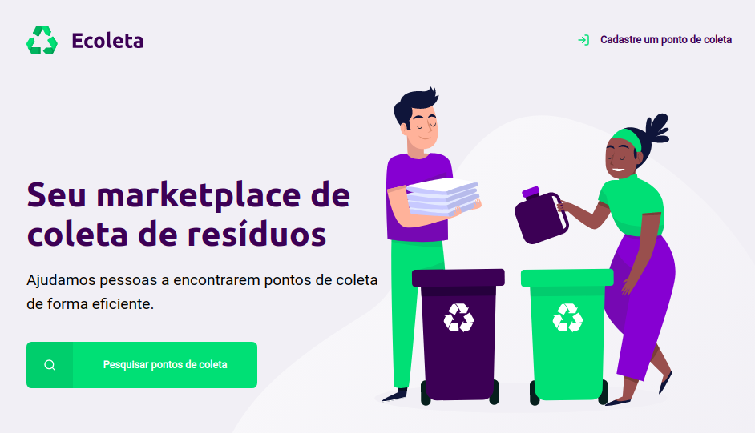

<h1 align='center'> Next Level Week by </h1> <h1 align='center'> </h1>
   

&emsp;Projeto Web realizado durante a Next Level Week, bootcamp realizado pela Rocketseat. A plataforma consiste em um ambiente para registrar pontos de coleta de materiais reciclaveis. 

<h3>
🥳 Dia 1 - Construção da Home: 
</h3>

&emsp;Foi feita a Home do projeto utilizando apenas HTML e CSS. Utilizando os materiais (arquivos svg) disponibilizados pela Rocketseat pode ser feito a Home interativa e responsiva. 

<h6 align='center'>🏷 Os dados serão atualizados até o fim do Bootcamp. 🏷</h6>
